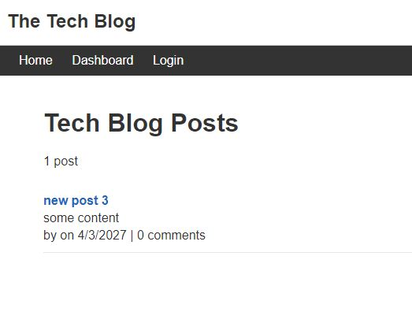

# Node.js MVC Blog

## Description

This is a Node.js CMS-style blog site that allows the user to create an account and then add blog posts, edit them, delete them, and add comments to posts. It utilizes the following technologies:

- Node.js
- Express.js
- MySQL database
- Sequelize
- MVC Architechture
- Handlebars.js as the template engine
- Dotnev for security
- Bcrypt for encryption of passwords and other sensitive data
- Express Session - Use of session variables and timeouts

## Table of Contents

- [Description](#description)
- [Installation](#installation)
- [Usage](#usage)
- [License](#license)
- [Contributing](#contributing)
- [Questions](#questions)

## Installation

To install the app locally, do the following:

- Download or clone the project files to your local system
- Download and install Node.js if you don't have it already
- Open a terminal window
- Navigate to the directory in which you placed the project files
- Type the command 'npm install' to install all project dependencies

## Usage

To run locally:
- Follow instructions from the installation section
- Open a terminal window
- Navigate to the directory you saved your project files in
- Type the command 'node server' to start the web server
- In a browser window navigate to 'http://localhost:3001'

Deployed Application:

[Heroku Application](https://salty-ocean-22261.herokuapp.com)

### Screenshot of Homepage:

### Screenshot of Dashboard:

## License

This project is covered under the [GNU General Public License v3.0](https://www.gnu.org/licenses/)

## Contributing

If you wish to contribute to this project, follow these steps:

- Fork the repository
- Clone or download to your local
- Make any changes/updates and push to your remote fork
- Start a pull request

## Questions

View my [GitHub Page](https://github.com/JonMooney)

Send me an email @ [jon.mooney@yahoo.com](mailto:jon.mooney@yahoo.com)